# ESP32-C3-Supermini Dino Game

A simple **Dino game** for the **ESP32-C3-SUPERMINI**, designed to run on a small **I2C 128x64 OLED display**. Jump over obstacles and try to get the highest score!  

---

## Features

- Classic dinosaur runner game  
- 16×16 sprites  
- Score tracking  
- Simple one-button jump control  

---

## Hardware Requirements

- **ESP32-C3-SUPERMINI**  
- **128x64 I2C OLED display**  
- **Push button** for jumping  

---

## Pin Connections

| ESP32-C3-SMINI | Component |
|----------------|-----------|
| 0              | Jump Button (connect to GND when pressed) |
| 4              | SDA (I2C data) |
| 5              | SCL (I2C clock) |
| 3.3V           | VCC of display |
| GND            | GND of display and button |

```mermaid
flowchart LR
    BTN[Jump Button]
    ESP[**ESP32-C3-SMINI**]
    DISP[OLED Display]

    %% Left side (Button)
    BTN -->|GPIO0| ESP
    BTN -->|GND| ESP

    %% Right side (Display)
    ESP -->|GPIO4 SDA| DISP
    ESP -->|GPIO5 SCL| DISP
    ESP -->|3.3V| DISP
    ESP -->|GND| DISP

    %% Style the ESP to be a square and bold
    style ESP fill:#004d04,stroke:#333,stroke-width:3px,stroke-dasharray: 5 5,rx:0,ry:0
```

> **Note:** The jump button uses `INPUT_PULLUP`. Pressing the button should connect it to GND.  

---

## Libraries Required

- [Adafruit GFX Library](https://github.com/adafruit/Adafruit-GFX-Library)  
- [Adafruit SSD1306 Library](https://github.com/adafruit/Adafruit_SSD1306)  

